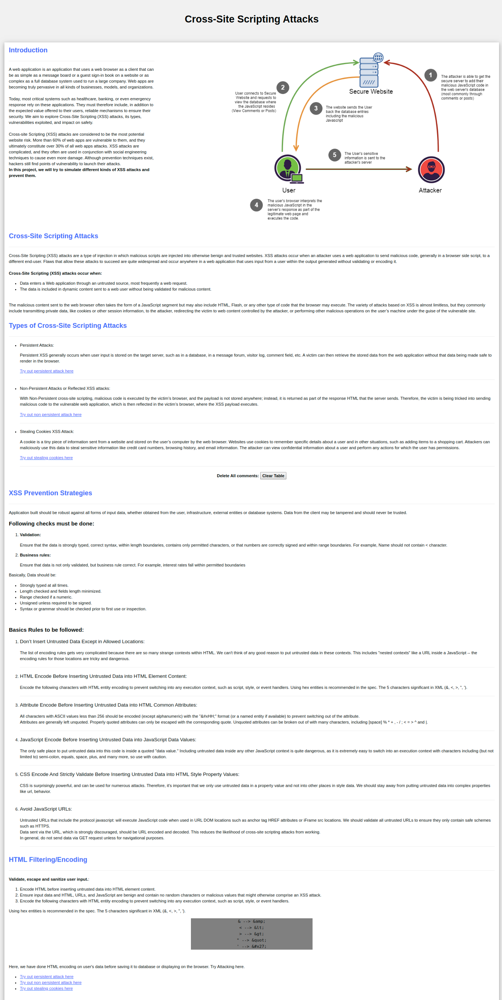

# Cross-Site-Scripting-attacks-CS547
This contains code/reports of the project done in course Foundations of Computer Security(CS547).


## Setup:

1. Clone the repository
2. Change directory to the folder/code directory.
3. Run the following command:
	```
		sudo chown www-data www/stolenCookies.txt
		sudo docker-compose up -d
	```
4. Open link: http://localhost:8001/index.php


Check out demo here: 
[](cross-site-scripting-attacks.mp4 "Simulate Cross-Site Scripting Attacks Demo") 

<!-- [Presentation](cross-site-scripting-attacks.mp4) -->